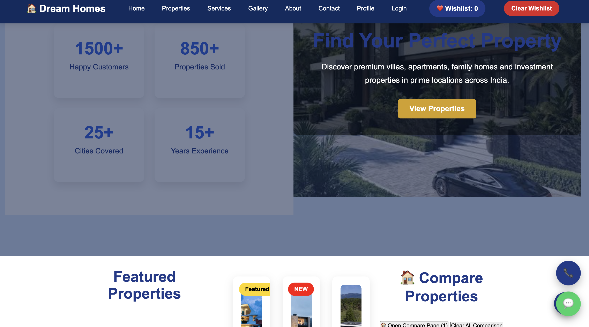

# 🏠 Dream Homes

A professional real estate website demo built with HTML, CSS and JavaScript.

## 🌐 Live Website

https://harsha11-h.github.io/dream-homes-demo/
## 🖥️ Website Preview


## ✨ Features

- 🏠 Property listings
- 🔍 Property search and filters
- 💰 Property price information
- 🛏 Bedroom filtering
- ⚖️ Property comparison
- ❤️ Wishlist
- ⭐ Property ratings
- 💬 Customer reviews
- 🏡 Property details pages
- 👨‍💼 Agent pages
- 📱 Responsive design
- 📊 User dashboard
- 🔐 Login and registration pages
- 🖼️ Property gallery
- 📞 Contact section
- 📅 Property visit booking
- 💵 EMI calculator

## 🏘️ Properties

The demo currently includes:

- Luxury Villa — Bangalore
- Modern Apartment — Hyderabad
- Family Home — Chennai

## 🛠️ Technologies

- HTML5
- CSS3
- JavaScript
- GitHub Pages

## 📁 Project Structure

```text
dream-homes-demo/
│
├── index.html
├── property1.html
├── property2.html
├── property3.html
├── property-details.html
├── compare.html
├── login.html
├── register.html
├── profile.html
├── dashboard.html
├── user-dashboard.html
│
├── css/
│   ├── style.css
│   └── responsive.css
│
├── js/
│   └── script.js
│
├── images/
│   └── property images
│
└── backend/
```
## 📞 Contact

Interested in a customized real estate website?

📧 Email: balajivandadi76@gmail.com

💬 WhatsApp: 7286999875

🌐 Live Demo:
https://harsha11-h.github.io/dream-homes-demo/
